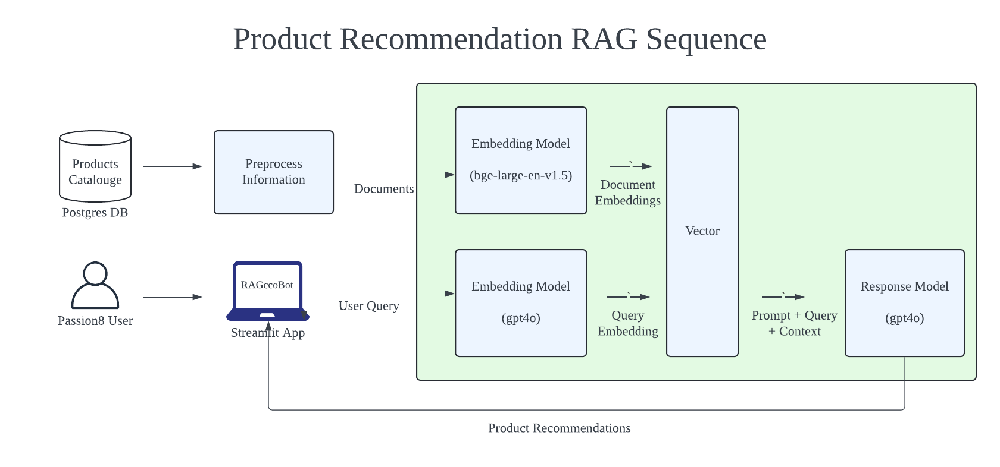

# RAGccoBot 🤖

RAGccoBot is a Streamlit-based AI chatbot application designed to provide users with personalized product recommendations from a specific product collection. It uses H2O GPT's Retrieval-Augmented Generation (RAG) for intelligent product matching based on customer queries. The chatbot offers recommendations with product names, IDs, and brief descriptions.

## Table of Contents
- [Features](#features)
- [Setup](#setup)
- [Usage](#usage)
- [Environment Variables](#environment-variables)
- [How It Works](#how-it-works)
- [Acknowledgements](#acknowledgements)

---

## Features
- **Retrieval-Augmented Generation (RAG)**: Uses H2O GPT's RAG model for high-quality tailored product recommendations.
- **User-Friendly Interface**: Simple and intuitive chat interface powered by Streamlit.
- **Session Management**: Maintains chat history using Streamlit's session state.

## Setup

### Prerequisites
- **Python 3.12.4**
- **Virtual Environment**: Recommended for dependency management.
- **H2O GPT API Key and Collection ID**: Required for connecting to H2O GPT's RAG model.


### Environment Variables
Create a `.env` file in the parent directory with the following environment variables:

```plaintext
H2O_API_KEY_CHATBOT=your_h2o_api_key
H2O_PRODUCTS_COLLECTION_ID=your_h2o_collection_id
```

- `H2O_API_KEY_CHATBOT`: Your H2O GPT API key.
- `H2O_PRODUCTS_COLLECTION_ID`: The collection ID for the product collection to retrieve recommendations from.

## Usage

1. Run the Streamlit application:
   ```bash
   streamlit run app.py
   ```

2. Open the link displayed in your terminal to access the application (usually `http://localhost:8501`).

3. Interact with the chatbot by asking questions about products. The bot will suggest relevant products based on your queries.

## How It Works



1. **Environment Variable Loading**: The application loads API keys and collection IDs from environment variables for secure access to the H2O GPT API, where our product database is uploaded and indexed.
2. **Chat Session Management**: The bot creates a session with H2O GPT for the current chat and maintains context throughout the interaction.
3. **User Input and Response**:
   - User inputs are sent to H2O GPT via the `H2OGPTE` client.
   - The bot processes the input using a Retrieval-Augmented Generation (RAG) approach, sourcing relevant products from the specified collection.
4. **Streamlit Interface**: Responses are displayed in an easy-to-use Streamlit chat interface, which logs user messages and bot responses for a seamless chat experience.

## Acknowledgements
- [H2O.ai](https://www.h2o.ai/) for providing the H2O GPT API and RAG capabilities.

