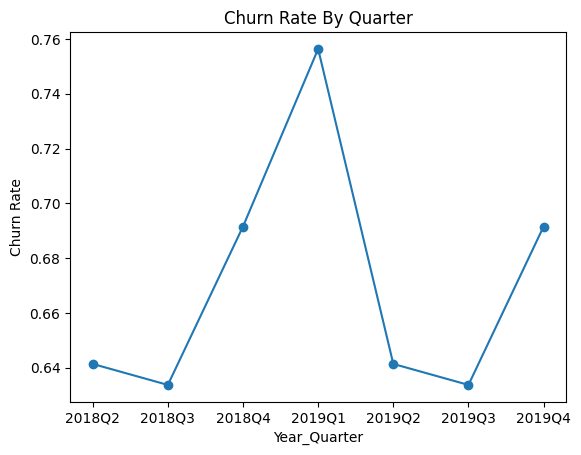
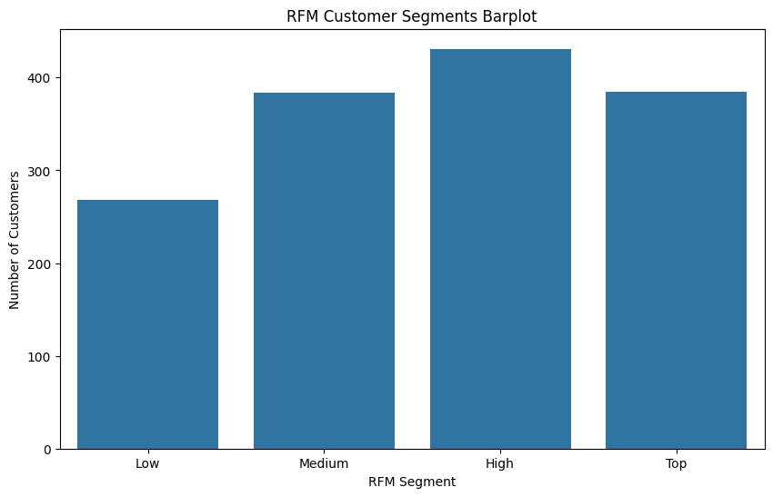
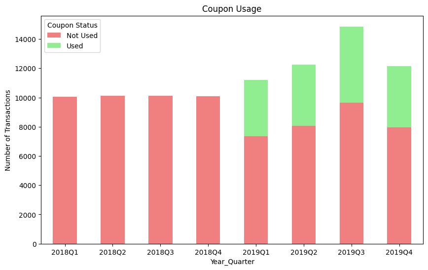
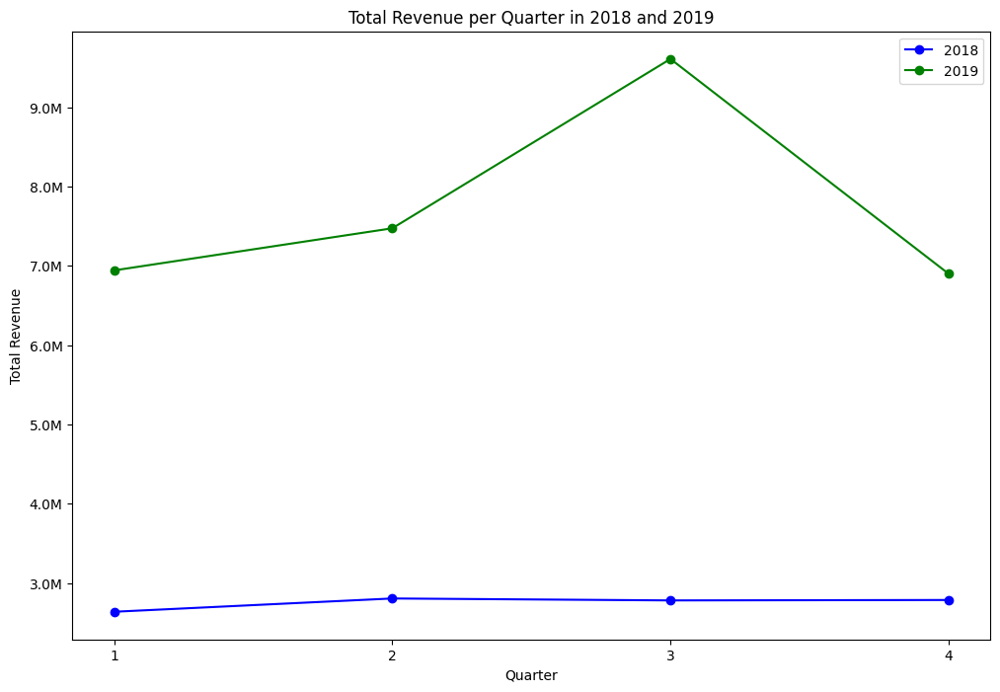

# How can we improve customer retention and lifetime value?

## Why is it important to improve customer retention and lifetime value?
Improving customer retention and lifetime value (CLTV) is crucial for the long-term success of any eCommerce business. Retaining existing customers is generally more cost-effective than acquiring new ones, as it eliminates the need for extensive marketing efforts and reduces overall acquisition costs. 

High retention rates foster customer loyalty, leading to increased repeat purchases and positive word-of-mouth referrals, which can significantly boost revenue. Additionally, by focusing on CLTV, businesses can better understand the long-term profitability of their customer base, enabling more strategic resource allocation and targeted marketing efforts. Ultimately, enhancing customer retention and CLTV not only drives immediate sales growth but also contributes to sustainable business development in an increasingly competitive marketplace.

## Data source used for analysis
In our analysis, we will utilize the online_sales table, which contains transaction data spanning from January 1, 2019, to December 31, 2019. This dataset encompasses transactions made through Amazon during this period, providing a comprehensive view of purchasing trends within the eCommerce platform.

During this period, a coupon retention strategy was implemented, offering customers discount coupons on various products. This strategy aimed to incentivize repeat purchases and enhance customer loyalty by providing tangible savings, ultimately influencing consumer behavior and driving sales growth.

## Generation of synthetic data
Due to data constraints, we lack information for the period before the coupon retention strategy was implemented. To facilitate comparison, we will generate synthetic data for 2018 to simulate user transactions without this strategy.

## Calculate customer churn rates and identify at-risk customers. 
Churn rate will be defined quarterly. For example, a user that makes a transaction in the previous quarter but not in the next quarter will be marked as churned.

From the line graph, churn rate is relatively similar over the quarters from 2018 to 2019, with the churn rate peaking during 2019 Quarter 1.

Referring back to the RFM segments plot, customers with low RFM scores, reflecting infrequent, low-value purchases or long inactivity, will fall into the Low segment. These customers are identified to be at risk customers.

## Analyze the effectiveness of current retention strategies.
We will analyze the effectiveness of the coupon strategy by comparing the total number of transactions, total revenue, improvements in customer lifetime value as well as churn rates between 2018 and 2019.

From the stacked bar chart, we can see that the number of transactions is higher in 2019, after the retention strategy (Coupon) is applied.

From the line graph, we see that after the coupon retention strategy is used in 2019, total revenue by quarter increases with respect to the total revenue in 2018.

Customer Lifetime Value (CLTV) is calculated for each customer in 2018 and 2019. By taking a difference in the 2019 CLTV with 2018 CLTV for each customer, we are able to determine whether the CLTV for the customer has increased. Overall, 51.43% of customers have an increase in CLTV from 2018 to 2019.

In terms of the total number of transactions and revenue, 2019 performed better than 2018 after the coupon strategy is applied. There is also an increase in CLTV for about 51% of users from 2018 to 2019. This could mean that the coupon strategy is generally effective in improving customer lifetime value.

However, when we look at the churn rate, churn rate is relatively similar over the quarters from 2018 to 2019. This could mean that the coupon strategy was not effective in customer retention. Instead, it might have helped encourage customers to make more purchases and in higher quantities, leading to a higher total number of transactions, revenue and customer lifetime value.

Due to data limitations, we are unable to assess whether the coupon strategy has led to more new users making transactions. Instead, we are only able to provide estimates on how transactions and revenue for current users might have increased from 2018 to 2019. Moving forward, when we are able to obtain data that spans over a few years, we would be better able to understand the effectiveness of retention strategies based on real life trends.